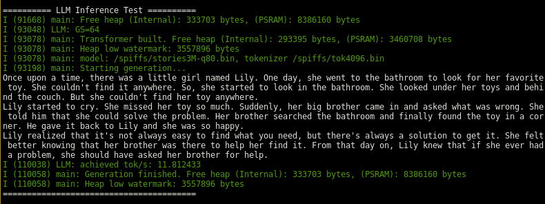

# ESP32-S3 LLM Inference Engine

This project is a optimized port of Andrej Karpathy's [llama2.c](https://github.com/karpathy/llama2.c) for the ESP32-S3 MCU. It runs both INT8 quantized and original F32 llama2-architecture models.

The codebase includes two engines (selectable via `idf.py menuconfig` -> LLM Configuration):
- **`llm.c`**: Based on `run.c` (unquantized, float32 inference). Can run full float32 models natively, achieving **~30 tok/s** on the unquantized f32 [tinystories260K](https://huggingface.co/karpathy/tinyllamas/tree/main/stories260K) model.
- **`llm8.c`**: Based on `runq.c`, running INT8 quantized model. This achieves **~12 tok/s** with the included 3.3M model trained on the same dataset. This is very close to the memory bandwidth limit of 13.1 tok/s.

Tested and verified on the [Waveshare ESP32-S3-LCD-1.9](https://www.waveshare.com/wiki/ESP32-S3-LCD-1.9) development board.

## ESP32-S3 Specific Optimizations

*   matmul hot loop is optimized for the hardware:
    *   On the INT8 version, this utilizes hardware SIMD PIE instructions in the Xtensa core (including all its memory alignment requirements).
    *   On the F32 version, this calls esp-dsp library to do the matrix multiplication.
*   On-the-fly token embedding table dequantization. The original version builds this table at the beginning which takes up precious RAM. This saves ~3.1MB of RAM for the 3.3M model.
*   Stores the "wave" activations (q, k, v, x, xb) in on-chip data RAM for fast access.
*   Callbacks on token generated instead of printing out directly.
*   Max out core, RAM, and SPI speeds, and uses the full 64KB data cache of the chip.
*   *Did not use the second Xtensa core*, because we're already hitting memory bandwidth limit at this point, not compute.

## Quick start

1.  Hardware: An ESP32-S3 board with at least 2MB of PSRAM for the 260K model, or 8MB for the 3M model.
2.  Models: Place your  `.bin` models and tokenizers in the `spiffs_data` directory. The 260K and 3M models are already included.
3.  *Optional*  Run `idf.py menuconfig` -> `LLM Configuration` to select your inference type and model paths.
4.  `idf.py build flash monitor`

